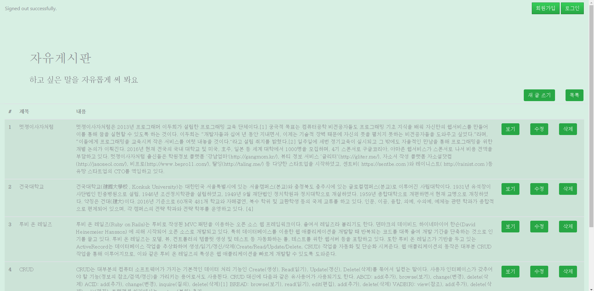
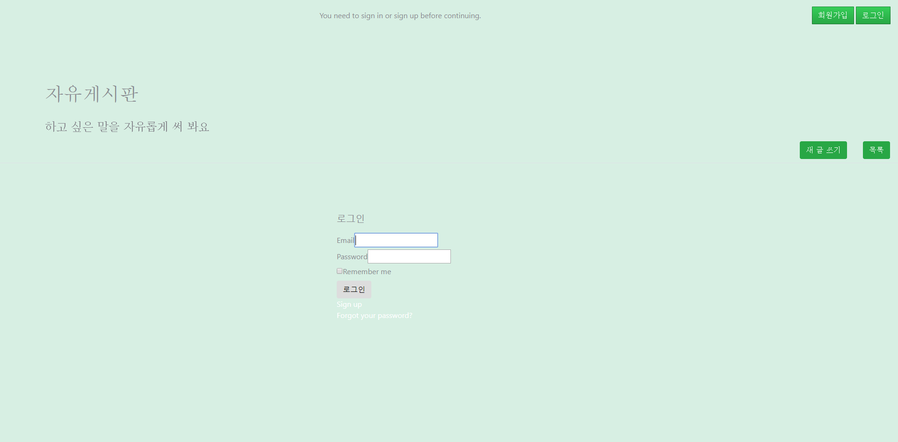
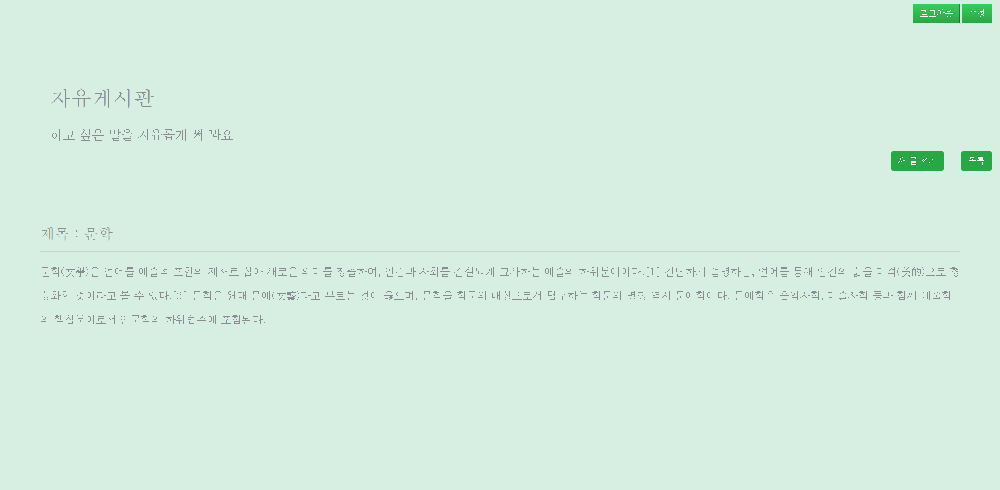

# 7주차 과제 : CRUD를 이용한 게시판에 devise 추가하기!

### 구현의도

 5주차 과제로 수행했던 'CRUD를 이용한 게시판'에 devise를 탑재하여 더욱 그럴듯하게 만든다.

### 오류 내용 / 해결 방법

 기록할만한 오류는 없었습니다!
 

### 간단한 소감

 수업시간에 현진이와 같이 진행했을 때는 굉장히 쉬운 느낌이었는데, 혼자해보려니까 버벅거리는 점이 다소 있었다.
 Practice makes perfect! 자주 접해고 익숙해져야겠다.
 그리고 정말 예쁘게 만들고 싶은데, 금손이 아니라서 쉽지 않다.. 참고할만한 예제를 찾아봐야겠다.

### 스크린샷
 
  
 
  
 
 
### 참고문서
 1. 건대 멋사 7주차 강의자료
 2. 부트스트랩
 3. Mackenzie Child - How to build a blog in rails 4
 4. https://github.com/plataformatec/devise    [devise gem page]
 

